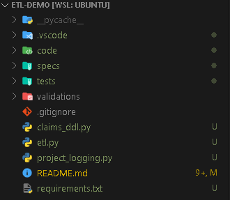
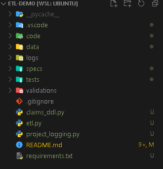

# etl-demo
Sample etl demo 

## Summary
Writing ELT pipe line to load the claims data into claim table with given data file and specification files with given connections strings

## Code Initial Structure
- 

## Code structure after the first step is executed. Data and Logs directories will be generated
- 

## Summary for each directory:
* <b>code</b>
    * helper directory: Created functions to make life easy
        * functions module
            * get_date_formats - get dates with requested format. Only get first day of the month between given dates
            * generate data - generates the data which takes number of records and date as input and generates data. 
        * generator module: creates txt files using the above functions
* <b>data</b>: All the data will be inside the data folder
    * Processed folder is created after etl script execution,successfully processed file and error files will be generated with timestamp.
* <b>logs</b>: logs will be generated per each module execution. Expect etl and generator log files
* <b>spec</b>: Data schema file is in this directory
* <b>tests</b>: Test functions are there in this directory 
* <b>validations</b>: functions validations are done in test functions and also loading validations are done as part of ELT pipeline
* <b>claims_ddl.py</b>: Has all the create_ddl_list
* <b>etl.py</b>: Has all ELT pipeline takes spec file , data file , loaction where claims sqllite database will be stored. 
* <b>claims_ddl.py</b>: wrote logging handler to save in file and stream data to the console
* <b>requirements.txt</b>: added the required libraries that are used for executing the etl script. 

# Order of exection: 
* python3 ./code/helper/generator.py
* python3 etl.py -s specs/claimsspec1.txt -d data/claimsdata_2020_01_01.txt -t validations

## Tables to expect
* claimsdata_stage
* claimsdata
* jobs_meta - has useful information for the load job including quality check 

* Sample Record in Json format, same record is in job meta table
* {
   * 'load_id': 'da2db6f7', 
   * 'data_filename': 'claimsdata_2020_02_01.txt', 
   * 'spec_file': 'claimsspec1.txt', 
   * 'spec_file_location': '/etl-demo/specs/claimsspec1.txt', 
   * 'etl_file': '/etl-demo/etl.py', 
   * 'source_location': '/etl-demo/data/claimsdata_2020_02_01.txt', 
   * 'file_source_count': 20, 
   * 'processed_file_location': '/etl-demo/data/processed/claimsdata_2020_02_01_082006.txt', 
   * 'stage_table_count': 20, 
   * 'target_count': 20, 
   * 'quality_check_result': 'Pass', 
   * 'rejected_records_count': 0, 
   * 'reject_records_location': 'Its Whiskey Time :)', 
   * 'record_created_date': datetime.datetime(2021, 3, 15, 8, 20, 6, 274072)
 *  }

## Validations
* Functions validations: python -m pytest -vv
* ETL validations are done while loading and recorded in jobs meta table
* sqlite database will be generated in the validations directory

